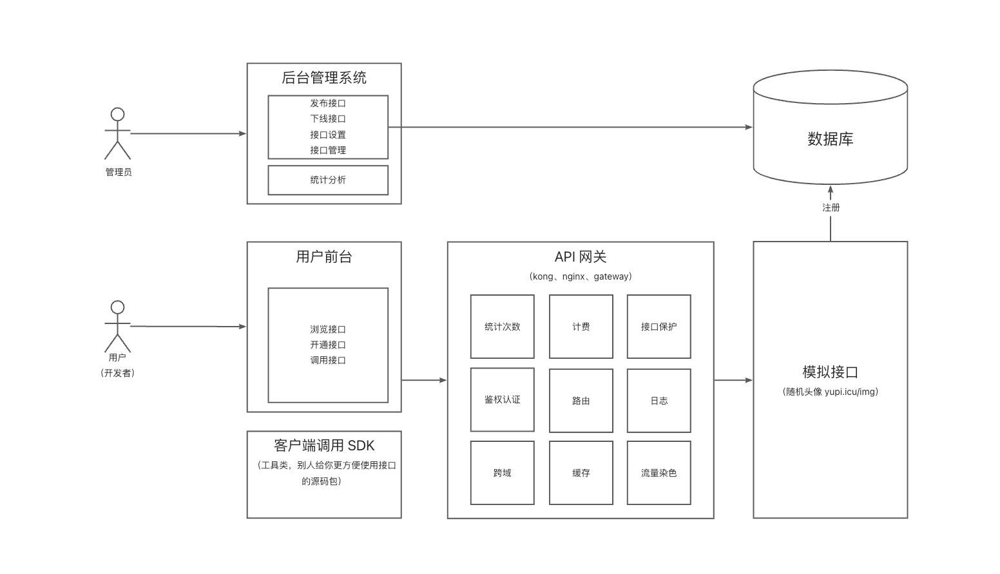
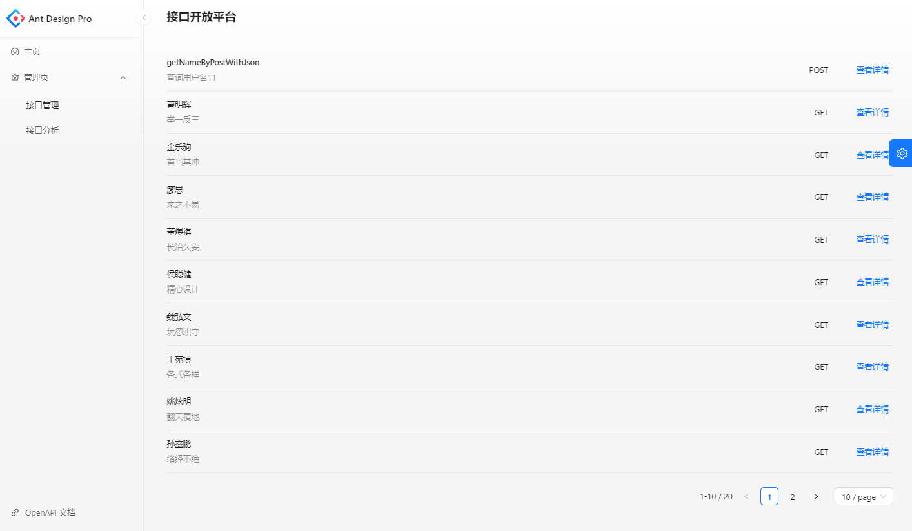
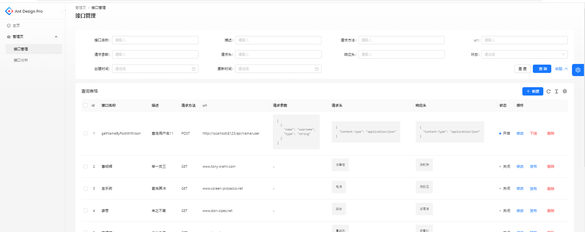
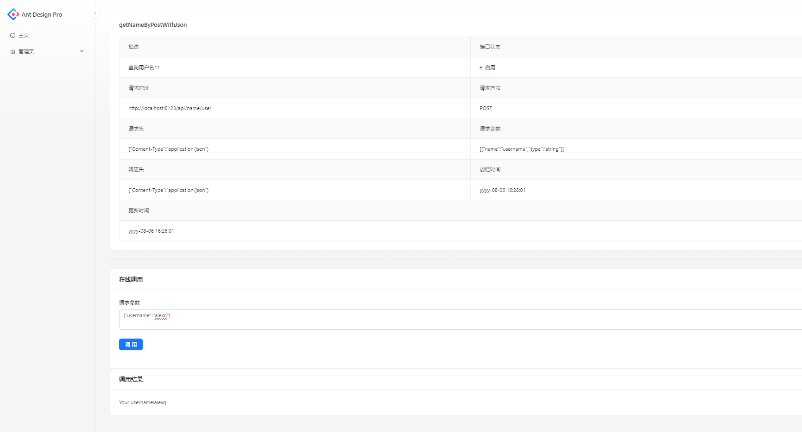

# AlexG API开放平台

# 前言

---

**做一个API接口平台:**

1.   防止攻击（安全性)
2.   不能随便调用(限制、开通)
3.   统计调用次数
4.   计费
5.   流量保护
6.   API接入

**项目介绍**

做一个提供API接口调用的平台，用户可以注册登录，开通接口调用权限。用户可以使用接口，并且每次调用会进行统计。管理员可以发布接口、下线接口、接入接口，以及可视化接口的调用情况、数据。

**业务流程**

**前端页面展示**

统一接口管理

接口调试

# 未来拓展点

1. 用户可以申请更换签名
2. 怎么让其他用户也上传接口？
   需要提供一个机制 (界面），让用户输入自己的接口host （服务器地址）、接口信息，将接口信息写入数据库。
   可以在 interfacelnto 表里加个 host 字段，区分服务器地址，让接口提供者更灵活地接入系统。
   将接口信息写入数据库之前，要对接口进行校验（比如检查他的地址是否遵循规则，测试调用），保证他是正常的。
   将接口信息写入数据库之前遵循咱们的要求（井且使用咱们的 sdk），在接入时，平台需要测试调用这个接口，保证他是正常的。
3. 网关校验是否还有调用次数
   需要考虑井发问题，防止瞬间调用超额。
4. 网关优化
   比如增加限流 /降级保护，提高性能等。还可以考虑搭配 Nginx 网关使用。
5. 功能增强
   可以针对不同的请求头或者接口类型来设计前端界面和表单，便于用户调用，获得更好的体验。
   可以参考 swagger、postman、knife4j 的页面。

